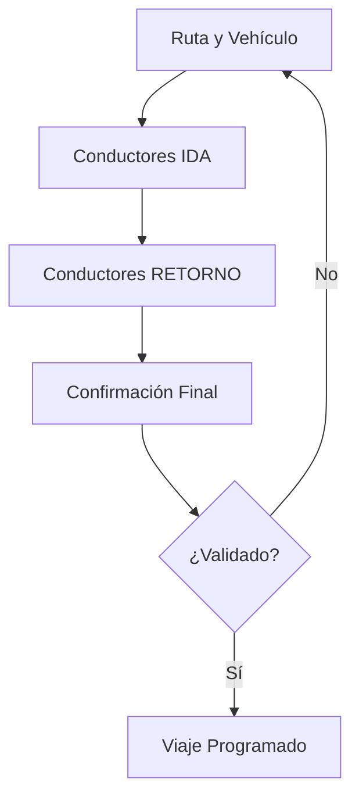
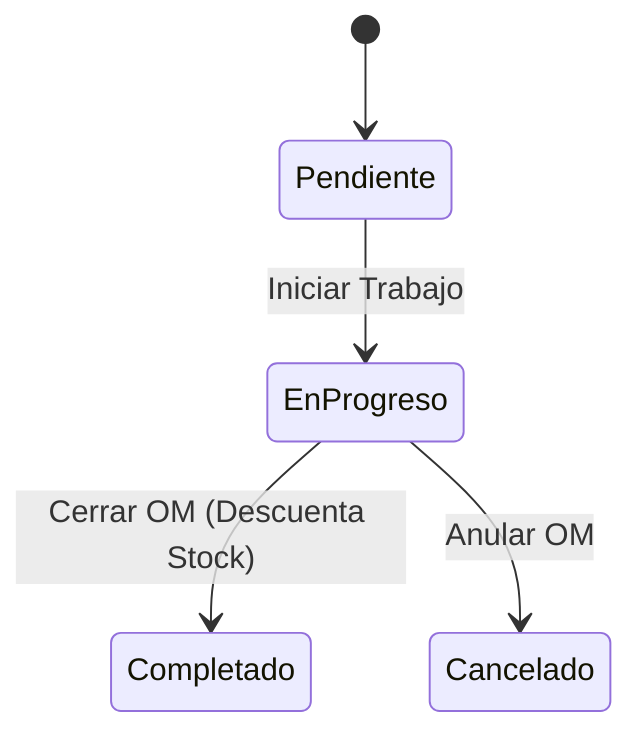
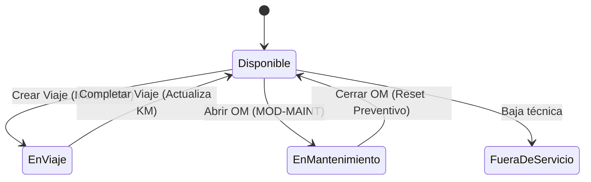
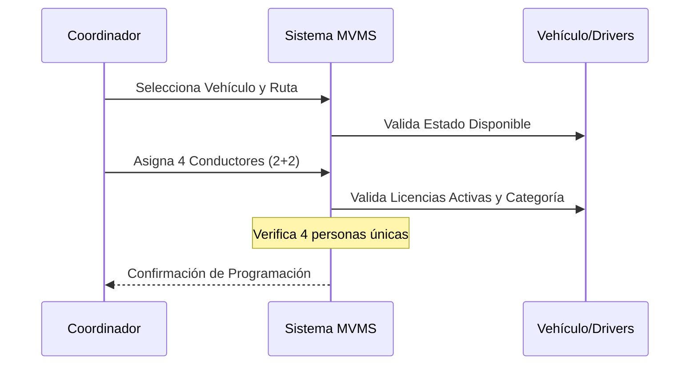

# MANUAL DE USUARIO - SISTEMA MVMS v2.0
## Gestión de Flota, Operaciones y Mantenimiento Minero

---

## 📑 ÍNDICE INTERACTIVO
1. [🚀 Guía de Inicio Rápido](#1-guía-de-inicio-rápido)
2. [🚚 Módulo de Operaciones](#2-módulo-de-operaciones)
3. [🔧 Módulo de Mantenimiento](#3-módulo-de-mantenimiento)
4. [⚙️ Reglas de Negocio y Diagramas](#4-reglas-de-negocio-y-diagramas)
5. [🛠️ Solución de Problemas (FAQ)](#5-solución-de-problemas-faq)
6. [📚 Glosario Técnico](#6-glosario-técnico)

---

# 1. 🚀 GUÍA DE INICIO RÁPIDO
*Realice las tareas críticas del sistema en pocos pasos.*

### Cómo crear un Viaje (Protocolo 2+2)
1. Ingrese a **Operaciones > Viajes** y pulse el botón **"Nuevo Viaje"**.
2. **Paso 1:** Seleccione el vehículo (solo aparecerán unidades disponibles) y la mina de destino.
3. **Paso 2 y 3:** Asigne los 2 conductores de ida y los 2 conductores de retorno (el sistema valida licencias automáticamente).
4. **Paso 4:** Revise el resumen de asignación y pulse **"Crear Viaje"**.

### Cómo abrir una Orden de Mantenimiento (OM)
1. Ingrese a **Mantenimiento > Órdenes** y pulse **"Nueva Orden"**.
2. Seleccione la **Unidad Vehicular**. El sistema capturará el kilometraje actual automáticamente.
3. Seleccione un **Mecánico** (el sistema indicará si está libre u ocupado) y el **Tipo de Mantenimiento**.
4. Pulse **"Guardar"** para registrar el inicio del servicio.

---

# 2. MÓDULO DE OPERACIONES

## 2.1 Planificación de Viajes (Wizard 2+2)
Este módulo garantiza que cada unidad minera cuente con los relevos necesarios para mitigar la fatiga.

**Instrucciones de Uso:**
1.  **Selección de Activos:** Solo podrá elegir vehículos en estado "Disponible".
2.  **Auditoría de Licencias:** El sistema filtrará automáticamente a los conductores cuya licencia esté vencida o no sea de la categoría requerida para la unidad.
3.  **Regla de Identidad:** No se permite asignar a la misma persona en más de una posición por viaje (se requieren 4 personas únicas).

---

# 3. MÓDULO DE MANTENIMIENTO

## 3.1 Gestión de Órdenes de Mantenimiento (OM)
Controla el ingreso, reparación y salida de unidades del taller.

**Instrucciones de Uso:**
1.  **Inicio de Taller:** Al pasar la OM a "En Progreso", el vehículo queda bloqueado automáticamente para cualquier viaje.
2.  **Registro de Repuestos:** Busque el ítem por código o nombre. El sistema registrará el costo del momento (**Snapshot Pricing**) para proteger los reportes financieros.
3.  **Inspección de Componentes:** Complete el checklist de seguridad (Frenos, Fluidos, Neumáticos) marcando cada hallazgo.
4.  **Cierre y Liberación:** Al completar la OM, el vehículo vuelve a estado "Disponible" y el stock de repuestos se descuenta del almacén.

---

# 4. REGLAS DE NEGOCIO Y DIAGRAMAS

## 4.1 Ciclo de Vida del Vehículo
El estado de la unidad cambia según las acciones realizadas en los distintos módulos.

## 4.2 Interacción de Seguridad (Flujo 2+2)
Validación cruzada entre coordinadores, vehículos y licencias de conducir.

---

# 5. 🛠️ SOLUCIÓN DE PROBLEMAS (FAQ)

| ¿Qué sucede? | Causa Probable | ¿Cómo solucionarlo? |
|--------------|----------------|---------------------|
| El vehículo no aparece en la lista de viajes. | La unidad ya está en ruta o en mantenimiento. | Verifique en el Dashboard el estado actual de la unidad. |
| No puedo avanzar en el asistente de viaje. | Falta un conductor o uno de ellos tiene la licencia vencida. | Revise las alertas de licencia en el Paso 2 o 3. |
| El stock de un repuesto no coincide. | Se agregaron repuestos a una OM que aún no se ha cerrado. | Los repuestos se descuentan del stock "Disponible" apenas se agregan a una OM. |
| No aparece el mecánico en la lista. | El mecánico tiene una OM activa ("En Progreso"). | El mecánico debe finalizar su tarea actual antes de recibir una nueva. |

---

# 6. 📚 GLOSARIO TÉCNICO

*   **Snapshot Pricing:** Técnica contable que captura y congela el precio de un repuesto al momento de su uso, evitando que cambios futuros de precio alteren reportes pasados.
*   **Protocolo 2+2:** Regla de seguridad obligatoria que exige 2 conductores para el tramo de ida y 2 diferentes para el retorno.
*   **Cluster/Caravana:** Grupo de vehículos que viajan juntos hacia un mismo destino.
*   **Inspección Crítica:** Hallazgo en el mantenimiento que requiere atención inmediata para garantizar la operatividad.

---
*MVMS v2.0 - Guía de Usuario Certificada*
*Última actualización: Abril 2026*
